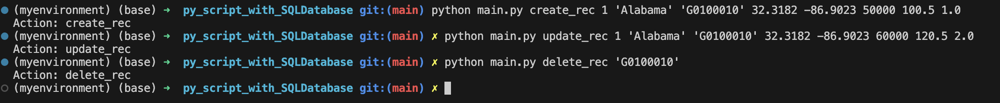

## Python Script interacting with SQL Database
### By Tursunai Turumbekova
[](https://github.com/tursunait/py_script_with_SQLDatabase/actions/workflows/cicd.yml)


## Project Overview

This project demonstrates how to connect to a SQL database using Python, perform CRUD operations (Create, Read, Update, and Delete), and execute SQL queries. The project also implements a CI/CD pipeline to ensure database operations work correctly and continuously. All operations can be performed via the command-line interface (CLI).

### Key Features:
- **Database Connection**: Establishes a connection to a SQLite database.
- **CRUD Operations**: Supports creating, reading, updating, and deleting records in the database.
- **SQL Queries**: Includes at least two distinct SQL queries to manipulate and retrieve data.
- **CI/CD Pipeline**: Automatically tests the correctness of database operations through the CI/CD pipeline.
- **Unit Tests**: Includes unit tests to verify the correct functionality of each CRUD operation.
- **CLI-Based Operations**: All CRUD operations and SQL queries can be executed via the command-line interface (CLI).

## File Structure

The project is organized into the following structure:
```bash
py_script_with_SQLDatabase/
│
├── mylib/
│   ├── extract.py           # Contains the function to extract data
│   ├── transform_load.py     # Contains the function to load and transform data into the SQLite database
│   ├── query.py              # Contains functions for CRUD operations and SQL queries
│
├── data/
│   └── urbanization.csv      # Sample dataset used for loading into the database
│
├── .github/
│   └── workflows/            # CI/CD pipeline configurations
│
├── main.py                   # Main script for executing CRUD operations via CLI
├── test_main.py              # Unit tests for the CRUD operations
├── Makefile                  # Automation for testing, linting, and formatting
├── requirements.txt          # Python dependencies
└── README.md                 # Project documentation
```

## Installation

1. Clone the repository:
    ```bash
    git clone https://github.com/tursunait/py_script_with_SQLDatabase.git
    cd py_script_with_SQLDatabase
    ```

2. Set up the virtual environment and install dependencies:
    ```bash
    python -m venv myenvironment
    source myenvironment/bin/activate  # On Windows use: myenvironment\Scripts\activate
    pip install -r requirements.txt
    ```

3. Run the script:
    ```bash
    python main.py
    ```

## Sample CRUD Operations

You can run the following commands via CLI to perform CRUD operations in the database:

- **Create**:
    ```bash
    python main.py create_rec 1 'Alabama' 'G0100010' 32.3182 -86.9023 50000 100.5 1.0
    ```

- **Read**:
    ```bash
    python main.py read_data
    ```

- **Update**:
    ```bash
    python main.py update_rec 1 'Alabama' 'G0100010' 32.3182 -86.9023 60000 120.5 2.0
    ```

- **Delete**:
    ```bash
    python main.py delete_rec 'G0100010'
    ```

- **Execute General Query**:
    ```bash
    python main.py general_query "SELECT * FROM urbanizationDB WHERE state = 'Alabama';"
    ```


Explanations of the functions can be found in the `main.py` script, where each CRUD operation is implemented.

### CI/CD, Linting, and Testing

- **Check format and test errors**:
    ```bash
    make format
    ```

- **Lint code**:
    ```bash
    make lint
    ```

- **Test code**:
    ```bash
    make test
    ```
## Query Log
This project includes a query log feature that tracks all SQL queries executed during the CRUD operations. The log records the following:
SQL statements for inserts, updates, deletes, and selects.
Each query is stored in a Markdown file **(query_log.md)**, providing a clear history of all database interactions.


## How to Use

### Running CRUD Operations:

- **Create Record**:
    ```bash
    python main.py create_rec <statefips> <state> <gisjoin> <lat_tract> <long_tract> <population> <adj_radiuspop_5> <urbanindex>
    ```

- **Read Data**:
    ```bash
    python main.py read_data
    ```

- **Update Record**:
    ```bash
    python main.py update_rec <statefips> <state> <gisjoin> <lat_tract> <long_tract> <population> <adj_radiuspop_5> <urbanindex>
    ```

- **Delete Record**:
    ```bash
    python main.py delete_rec <gisjoin>
    ```

- **Execute General Query**:
    ```bash
    python main.py general_query <SQL query>
    ```

### Testing and CI/CD Pipeline:

The project includes unit tests for each CRUD operation and a CI/CD pipeline to automate the testing process.

- To run tests:
    ```bash
    make unittest
    ```

- The CI/CD pipeline will automatically verify the correctness of the database operations by loading the `.db` file and running the tests as part of the pipeline process.

