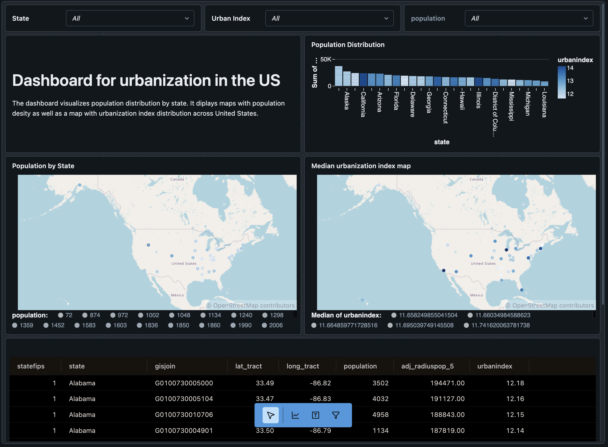

## Python Script interacting SQL Queries with Databricks - Urbanization Index Analysis 🚀
### By Tursunai Turumbekova
[](https://github.com/nogibjj/SQL_Query_Databricks1_Tursunai/actions/workflows/cicd.yml)

Welcome to my project, where data meets cloud! This project takes you on an analytical journey through urbanization data, leveraging **Databricks SQL Warehouse** to query large datasets and discover patterns about urbanization across various states. We’ll be diving into urbanization metrics, from identifying the most urbanized states to analyzing population distributions. 🌍🏙️

## Project Overview 🧐

This project uses **Databricks** as the database engine to store, query, and analyze joint urbanization datasets from FiveThirtyEight public dataset. It’s structured to demonstrate the power of SQL queries when applied to real-world datasets, giving you a deeper look into:
- **Urbanization trends** by state
- **Population dynamics** within urbanized areas
- **Interesting insights** derived from urbanization indices over time

The code performs the heavy lifting in Databricks, allowing you to focus on understanding the results. Along the way, all the executed queries and results are meticulously logged in the `query_log.md` file for transparency and easy tracking.

## Key Features 🔑

- **ETL Pipeline**: Extract data from public datasets, transform it, and load it into Databricks SQL Warehouse.
- **Data Analysis**: Execute complex SQL queries to identify patterns such as average urbanization, state-wise comparisons, and urban population density.
- **Query Logging**: Each query executed is logged with its result, so you can track every operation in the `query_log.md` file.
- **Seamless Cloud Integration**: The project leverages Databricks for cloud-based computation, allowing efficient analysis of large datasets.


## Example Queries 💡
Here are a few queries you might find fun to run:

### Top 5 States by Average Urbanization Index:

```sql
SELECT us.state, round(avg(u.urbanindex)) AS urbanindex
FROM default.urbanization_statedb_tt284 us RIGHT JOIN default.urbanizationdb_tt284 u ON us.state=u.state
GROUP BY us.state
ORDER BY urbanindex desc
LIMIT 5;
```
SELECT us.state, round(avg(u.urbanindex)) AS urbanindex
FROM default.urbanization_statedb_tt284 us RIGHT JOIN default.urbanizationdb_tt284 u on us.state=u.state
group by us.state
order by urbanindex desc;
### States with the Largest Rural Areas (Low Urbanization Index):

```sql
SELECT state, COUNT(*) AS rural_area_count
FROM default.urbanizationdb_tt284
WHERE urbanindex < 5
GROUP BY state
ORDER BY rural_area_count DESC;
```
### Correlation Between Population and Urbanization Index:

```sql
SELECT CORR(urbanindex, population) AS correlation
FROM default.urbanizationdb_tt284;
```
## Data Sources 📊
The datasets used in this project are public datasets from FiveThirtyEight, focusing on urbanization and state-level metrics. You can find the datasets in the data/ directory or pull them directly using the extraction pipeline.

## Project Structure 🗂️
Here’s a quick overview of the key files and directories:

```plaintext
Copy code
SQL_Query_Databricks1_Tursunai/
├── data/                         # Contains the raw datasets
├── mylib/                        # Contains the ETL and query scripts
│   ├── extract.py                # Script to extract and store datasets
│   ├── transform_load.py         # Script to transform and load data into Databricks
│   └── query.py                  # Script to run queries on Databricks
├── query_log.md                  # Logs all the queries and their results
├── requirements.txt              # Python dependencies
├── README.md                     # This fun guide!
└── main.py                       # Main script for executing SQL queries
```
## Tools and Technologies 🛠️
*Python*: For scripting the ETL and querying process.
*Databricks*: Cloud service for querying and analyzing data.
*SQL*: To perform data extraction and transformation on Databricks.
*dotenv*: For environment variable management.
*Makefile*: To automate tasks like extracting, transforming, and querying.

## Interactive Databricks Dashboard for Urbanization in the US 🌆
This Databricks dashboard provides a visual exploration of urbanization trends across the United States. It combines population distribution, urbanization indices, and geographical data to give users a clear picture of urban development by state.

Population Distribution: Displays the population across states, highlighting areas with higher urbanization.
Geospatial Maps: Show population density and median urbanization index, offering an intuitive, visual understanding of demographic trends.
Data Table: Provides specific metrics like population and urbanization index for further analysis.
Why This Matters:
Including this dashboard in the project enhances user interaction and understanding of complex data. It highlights Databricks' capabilities for processing and visualizing large datasets, providing actionable insights into urbanization patterns.
The dataset contains geospatial data of the locations with urban density, an interactive 


## License 📄
This project is licensed under the MIT License. See the LICENSE file for more details.
